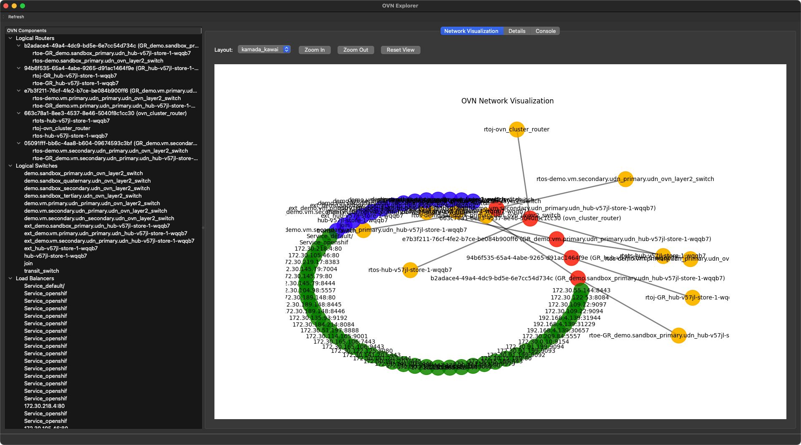

# OVN Explorer

A graphical application for exploring Open Virtual Networks (OVN) in OpenShift environments. This application connects to a northbound database pod and visualizes OVN components such as Logical Routers, Logical Switches, Load Balancers, and Ports.



## Features

- Connect to OVN northbound database pods in OpenShift clusters
- Visualize OVN network topology
- Explore details of OVN components:
  - Logical Routers
  - Logical Switches
  - Load Balancers
  - Ports
- Interactive network visualization with multiple layout algorithms
- Detailed component information display
- Console for executing OVN commands

## Requirements

- Python 3.8+
- OpenShift cluster with OVN networking
- Access to the OpenShift cluster via `oc` command-line tool
- Kubernetes configuration (`~/.kube/config`) with appropriate permissions
- pyenv (for Python version management)

## Installation

1. Clone the repository:
   ```
   git clone https://github.com/dlbewley/ovn-explorer.git
   cd ovn_explorer
   ```

2. Install pyenv (if not already installed):
   ```bash
   # macOS
   brew install pyenv

   # Linux
   curl https://pyenv.run | bash
   ```

3. Add pyenv to your shell configuration:
   ```bash
   # Add to ~/.bashrc, ~/.zshrc, or ~/.bash_profile
   export PYENV_ROOT="$HOME/.pyenv"
   [[ -d $PYENV_ROOT/bin ]] && export PATH="$PYENV_ROOT/bin:$PATH"
   eval "$(pyenv init -)"
   ```

4. Install os prerequisites:
   ```bash
   brew install tcl-tk@8
   brew install qt@6
   ```

5. Install and set up Python:
   ```bash
   # Install Python 3.8 or newer
   PYTHON_VERSION=3.12.3
   APP_NAME=ovn-explorer
   export LDFLAGS="-L/opt/homebrew/opt/tcl-tk@8/lib"
   export CPPFLAGS="-I/opt/homebrew/opt/tcl-tk@8/include"
   export PKG_CONFIG_PATH="/opt/homebrew/opt/tcl-tk@8/lib/pkgconfig"
   env \
      LDFLAGS="$LDFLAGS" \
      CPPFLAGS="$CPPFLAGS" \
      PKG_CONFIG_PATH="$PKG_CONFIG_PATH" \
      pyenv install PYTHON_VERSION
   
   ```

6. Create and activate a virtual environment:
   ```bash
   # Create a new virtual environment
   pyenv virtualenv "$PYTHON_VERSION" "$APP_NAME"
   
   # Set local Python virtualenv for this project (.python-version)
   pyenv local $APP_NAME
   ```

7. Install dependencies:
   ```bash
   pip install -r requirements.txt
   ```

## Configuration

The application uses a YAML configuration file located at `config.yaml` in the application directory or at `~/.ovn_explorer/config.yaml`. You can customize the following settings:

- OVN connection settings (namespace, label selector, container)
- GUI settings (theme, window size)
- Visualization settings (node size, edge width, font size)
- Logging settings

Example configuration:

```yaml
# OVN Connection Settings
ovn_connection:
  namespace: openshift-ovn-kubernetes
  label_selector: app=ovnkube-node
  container: nbdb
  # kubeconfig: ~/.kube/config  # Uncomment to specify a custom kubeconfig path
  # node_name: worker-1  # Uncomment to specify a specific node

# GUI Settings
gui:
  theme: light  # light or dark
  window_size: [1024, 768]

# Visualization Settings
visualization:
  node_size: 800
  edge_width: 2
  font_size: 10

# Logging Settings
logging:
  level: INFO  # DEBUG, INFO, WARNING, ERROR, CRITICAL
```

## Usage

1. Ensure you are logged into your OpenShift cluster using the `oc` command-line tool:
   ```
   oc login --token=<token> --server=<server>
   ```

2. Run the application:
   ```
   python src/main.py
   ```

3. The application will connect to the OVN northbound database pod and display the network topology.

4. Use the left panel to browse OVN components, and click on a component to view its details.

5. Use the visualization tab to explore the network topology with different layout algorithms.

## Development

### Project Structure

```
ovn_explorer/
├── config.yaml           # Configuration file
├── requirements.txt      # Python dependencies
├── src/                  # Source code
│   ├── main.py           # Entry point
│   ├── config/           # Configuration handling
│   │   └── settings.py   # Settings module
│   ├── gui/              # GUI components
│   │   └── main_window.py # Main window
│   ├── ovn/              # OVN interaction
│   │   └── connection.py # OVN connection handling
│   └── visualization/    # Visualization components
│       └── network_view.py # Network visualization
└── tests/                # Tests
```

### Adding New Features

To add support for additional OVN components:

1. Update the `OVNConnection` class in `src/ovn/connection.py` to retrieve the new component data
2. Add the new component to the component tree in `src/gui/main_window.py`
3. Update the network visualization in `src/visualization/network_view.py` to include the new component

## License

[MIT License](LICENSE)

## Contributing

Contributions are welcome! Please feel free to submit a Pull Request.
